# AI Usage Tracker for Hermes

Subscription quotas, request-level token accounting, cache analysis and skills/context history in Hermes Desktop.

This fork extends [lvabarajithan/hermes-ai-usage-tracker](https://github.com/lvabarajithan/hermes-ai-usage-tracker). It started from the **2.0.0-test.17** ledger import and includes subsequent recording, performance and UI improvements. The original MIT licence and quota integrations are retained. This is a development fork, not an official Hermes release.
<p>
    <a href="docs/images/live-subscriptions.png">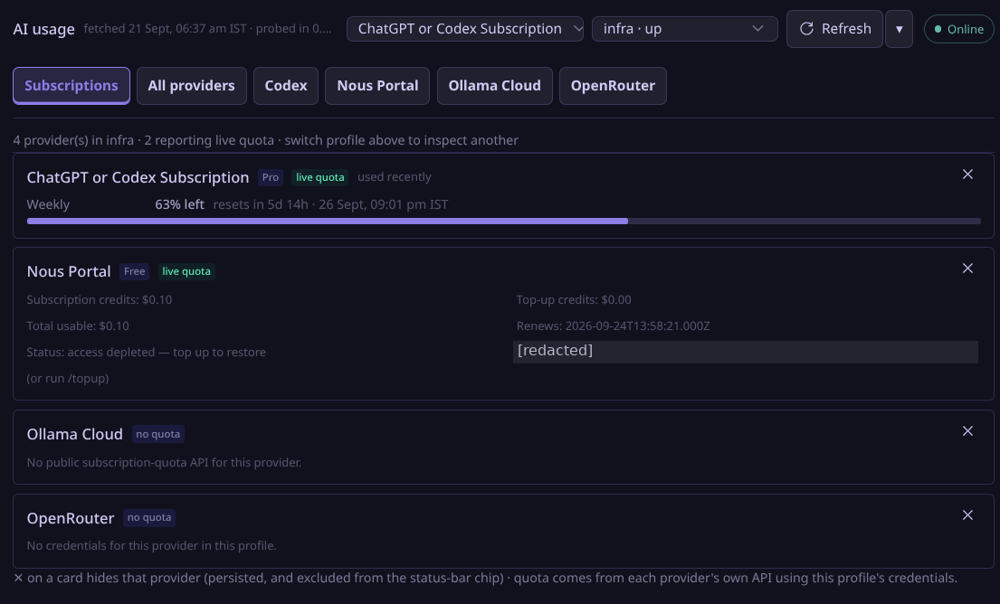</a>
    <a href="docs/images/live-overview.png">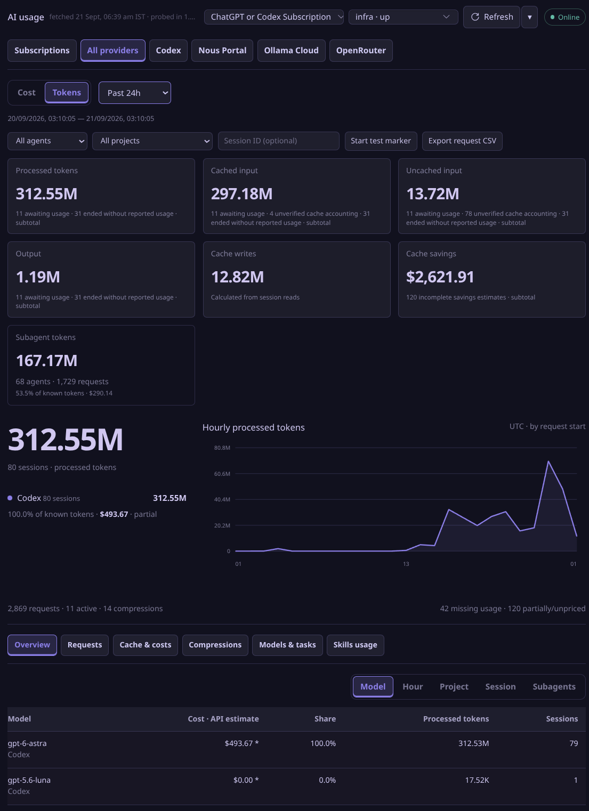</a>
</p>
[Features](#behaviour) · [Provider coverage](#provider-coverage) · [Installation](#installation-is-separate-from-source-changes) · [Development](#development-checks)

## Behaviour

- **All profiles** is the first profile-picker option and combines recorded usage across discovered local Hermes profiles without changing the existing selected-profile preference. Record identities remain profile-qualified; missing, unrecorded or unreadable sources produce explicit coverage states rather than invented zeros. Subscription allowances are not combined—select an individual profile for quota cards.
- Aggregate mode is read-only, checks a cheap change token every 30 seconds while open, and has no aggregate event stream. A visible rolling window is recomputed each minute for expiry; older backends without change checks fall back to at most one visible full read per minute. Test markers, pricing changes and analytics reload are disabled. Each full read copies ledger/WAL snapshots into temporary storage, so large histories increase disk I/O. Ambiguous hardlinked databases and nonempty rollback journals are rejected. CSV includes profile provenance and detects observed changes during paging, but is not an atomic cross-profile snapshot.
- Activating **All profiles** after installation requires a safely arranged Hermes backend restart; the analytics-only reload button cannot load its new API routes. No restart is performed by the installer.

- **Subscriptions** opens first with the original quota cards, profile picker, refresh, status-bar provider selection and hide/unhide controls.
- Provider cards with six or more quota/detail rows use two columns when the card is wide enough, reverting to one in narrow panes. Nous Portal can show a subscription gauge and renewal detail when supplied by its account response; no weekly allowance is invented.
- All providers and individual providers have nested Overview, Requests, Cache & costs, Compressions, Models & tasks and **Skills usage** pages. Individual provider pages retain their quota card above analytics.
- **Skills usage** uses the global period/profile/provider/project/session/agent filters, plus a model filter. Click the frequency pie or its legend to inspect timestamped loads and reference reads. Context footprint and Session timeline show recorded estimates and linked compression boundaries. No duplicate frequency bar chart, historical reconstruction or prompt/result body storage. See [SKILLS_USAGE.md](SKILLS_USAGE.md) for capture limits and the API contract. New recording requires reloading the updated backend and producer processes; analytics-only reload cannot install these hooks.
- Native request hooks and guarded runtime adapters record usage in each producing Hermes home's `usage-ledger/events.sqlite3`. The UI refreshes persisted events; it does not reconstruct usage from cumulative session counters.
- Displayed **Cache writes** is the sum of positive consecutive cache-read differences within each session stream. Its caption is **Calculated from session reads**. Provider counters and saved costs remain separate and unchanged; calculated writes are not additional processed tokens.
- Request JSON, CSV, attribution, compression correlations and saved price snapshots preserve missing-versus-zero distinctions.
- New attribution uses same-profile active named projects and explicit folder ownership. Historical changes are operator-only: see [PROJECT_ATTRIBUTION.md](PROJECT_ATTRIBUTION.md) for the dry-run/apply reconciliation CLI and preservation guarantees.
- Selected-profile usage listens for recorder events and checks a cheap, read-only filesystem change token every 20 seconds for missed events and catalogue-only changes. A token is a best-effort hint, **not** a SQLite revision or an accounting delta: only a fresh full response publishes totals, requests and groups together. One generation owns each view; hints during a read trigger a separate follow-up after it clears. Manual Refresh alone shows a busy control; automatic updates leave the last good response visible. Failed reads show a stale warning and retry with bounded backoff. Rolling windows also re-read once per visible minute to account for expiry; an unsupported change-check route uses a bounded visible-page full-read fallback. Large reports can still take substantial time, and there is no incremental-read acceleration.
- Requests, saved-rate groups, Compressions and Models & tasks retain tables where they fit and become initially collapsed accordions in narrower panes. Headers expose identity and known token values; expanded records retain their labelled fields and JSON controls. Responsive changes preserve keyed records and keyboard focus.
- Compression headers use **Start** for the configured threshold and **End** for the first subsequent reported input. These are not exact before/after measurements: the threshold is not measured starting usage, and the next request may include new content. Missing values remain **—**.
- Skills pies sit above their legends, capped at 320px. Legends use one, two or three columns according to pane width. Session timeline accordions retain open state and reading position, with bounded internal scrolling.

Read [SESSION_CACHE_WRITES.md](SESSION_CACHE_WRITES.md) for the current calculation contract, [ANALYTICS_RELOAD.md](ANALYTICS_RELOAD.md) for the Refresh menu and real connection indicator, and [COMPATIBILITY.md](COMPATIBILITY.md) for capture limitations. Historical sections in imported documents describe earlier releases, not fresh validation. [UPSTREAM_README.md](UPSTREAM_README.md) describes the original quota-only plugin.

## Provider coverage

Recording follows Hermes' protocol paths rather than a fixed provider-name list. **Token recording, cost estimates and subscription quotas have different coverage.**

| Area | Current coverage |
|---|---|
| Main request recording | Normal Hermes hooks for OpenAI-compatible Chat Completions, Responses and Anthropic Messages, when the producing process loads this plug-in. |
| Claude / Anthropic | Native main-stream usage snapshots survive interruption; absent cache fields remain unknown. Only received counts can be retained. |
| Gemini | Native metadata is captured before conversion inserts defaults or drops thinking counts. Thinking is included once and reported totals are preserved. |
| Cost estimates | Exact matched catalogues for OpenAI, OpenRouter, Nous and Ollama. Direct Anthropic/Gemini and other unmatched providers can record tokens while remaining unpriced. Estimates are not subscription debits. |
| Subscription cards | Only available provider quota APIs and reported windows. Recording support does not imply a quota API exists. |
| Not certified as complete | Custom transports, separate app-server/ACP runtimes, some direct-streaming auxiliary calls and SDK-internal retries below observed hooks. |

See [COMPATIBILITY.md](COMPATIBILITY.md) for detailed boundaries. Synthetic tests establish source-contract behaviour, not authenticated compatibility with every provider. Historical missing usage is not reconstructed.

## Repository layout

The plugin now lives at the repository root, matching the upstream installation layout:

```text
plugin.yaml                 Plugin identity and hook declarations
__init__.py / bootstrap.py   Recorder registration and runtime loading
desktop/plugin.js           Desktop quota and analytics UI
dashboard/plugin_api.py     Original quota routes plus ledger API
ledger_runtime/             Capture, accounting, attribution, storage and pricing
tests/                      Offline Python and browser checks
docs/images/                Cropped, redacted real-app README screenshots
install.py                  Explicit-home installer with receipts and rollback
doctor.py                   Offline Hermes source-signature inspection
cache_write_report.py       Explicit-home cache-evidence report
build_preview.py            Refresh the synthetic preview from desktop/plugin.js
preview.html                Synthetic offline SDK/React harness
```

The installer copies only named plugin files and runtime directories, not repository history, tests or private archives. The retained `catalog/` files describe the original upstream release and are **not a release declaration for this fork**. Do not run the upstream publication script to publish this build.

## Development checks

See [RECORDER_LIFECYCLE.md](RECORDER_LIFECYCLE.md) for turn-scoped cleanup, late-usage handling and the meaning of unavailable-field indicators. Historical unknown counters are not fabricated or backfilled.

Use an isolated environment; do not install test dependencies into a running Hermes environment:

```bash
uv venv .venv
uv pip install --python .venv/bin/python -r requirements-dev.txt
.venv/bin/python -m pytest -q --ignore=tests/ui
node --check --input-type=module < desktop/plugin.js
```

Browser suites are executable scripts, not pytest test functions. Install Chromium with Playwright, set `CHROMIUM_PATH` to its executable, regenerate `preview.html` with `build_preview.py`, then run the individual `tests/ui/test_*.py` scripts. They use synthetic records and an offline SDK; passing them does not establish live capture coverage or native clipboard behaviour.

Tests set `HERMES_USAGE_PRICING_OFFLINE=1` and use temporary fixture databases. Keep `HOME`, `HERMES_HOME` and temporary output isolated from real Hermes data when running verification.

The optional native-provider contract tests require `HERMES_CAPTURE_CORE` pointing to an explicitly supplied read-only Hermes source tree. Without it, source-dependent tests skip. They execute selected real conversion/dispatch definitions with synthetic transports, not Hermes startup or authenticated clients. The provider-fix verification ran **318 Python tests successfully**, including these contracts; that is a recorded check, not a promise about every future environment.

## Installation is separate from source changes

Against an explicitly chosen, existing real Hermes home:

```bash
python3 install.py --home /actual/hermes/home
# Only when installation is intended:
python3 install.py --home /actual/hermes/home --apply
```

The first command is plan-only. Applying creates file backups and a rollback receipt, but does not enable the plugin, restart producers, alter credentials or remove ledger data. **The native Claude/Gemini observer and accounting updates require restarting the backend and producing agents at a safe time. Analytics-only reload is insufficient.** Desktop UI files can hot-reload independently. Do not disrupt active workloads. Symlink destinations are refused; identify the real installation before applying.

Enable only once per intended profile. This plugin needs no built-in tool override permission. For example:

```bash
hermes --profile infra plugins enable ai-usage-tracker --no-allow-tool-override
```

The explicit denial avoids Hermes's legacy override question and clears an existing override grant in the selected profile. Ordinary file updates do not need another enable command. Native `hermes plugins install nonspacial/hermes-ai-usage-tracker --enable` is an alternative only after the intended source revision has been published; it installs remote code, not uncommitted local changes. Do not use `--force` to replace a working installation without first arranging preservation of local changes.

Quotas and background pricing can make network calls. The recorder does not add inference calls, collect prompt/response text or export credentials. Local paths and session IDs are private metadata; review exports before sharing.

## Local import provenance

The fork and upstream `main` both resolved to `77bdf112117d6d8811477d8837d3cb9a3a9d99d9` during import. All original-source entries in `UPSTREAM_SOURCE_MANIFEST.json` matched that checkout. `PRESERVED_UPSTREAM.json` retains component/probe regression fingerprints.

On the originating workstation, all pre-existing project contents were preserved under Git-ignored `.local-history/`, including the complete handoff, original test.17 package, archives and historical usage exports. They are not part of the publishable repository. At the original import, runtime/UI source was unchanged and development paths and installer packaging were adapted to this root layout. Subsequent changes are recorded in Git history; see [IMPORT_NOTES.md](IMPORT_NOTES.md) for the historical import checks.

## Screenshots

Real-app captures with private identifiers redacted. Click to enlarge. Token values are snapshots; dollar figures are API-equivalent estimates, not subscription charges.

<p>
<a href="docs/images/live-requests-table.png">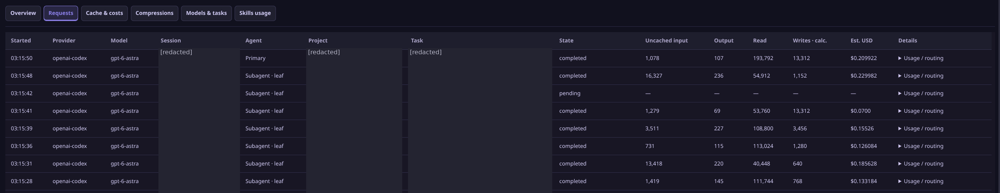</a>
<a href="docs/images/live-cache-wide.png">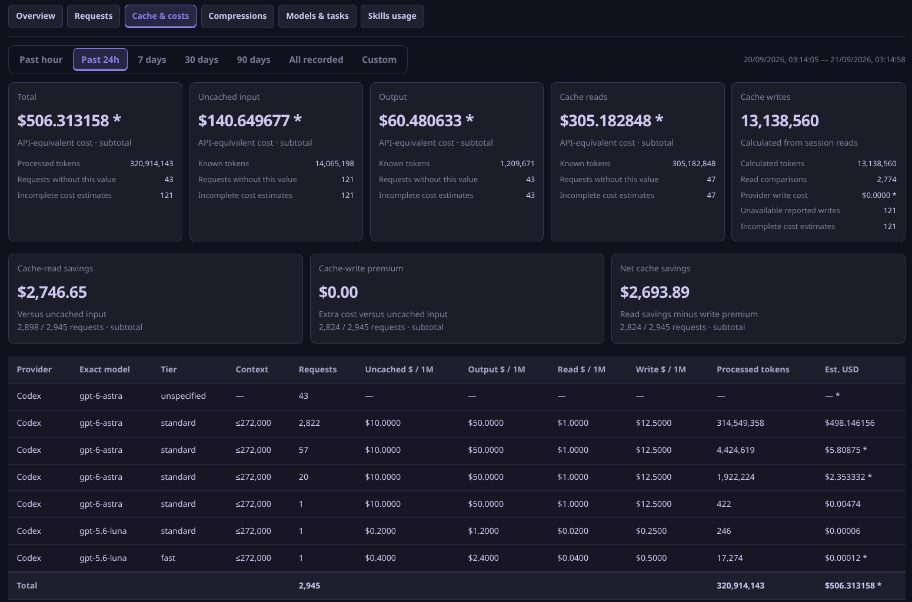</a>
</p>

<p>
<a href="docs/images/live-compressions.png">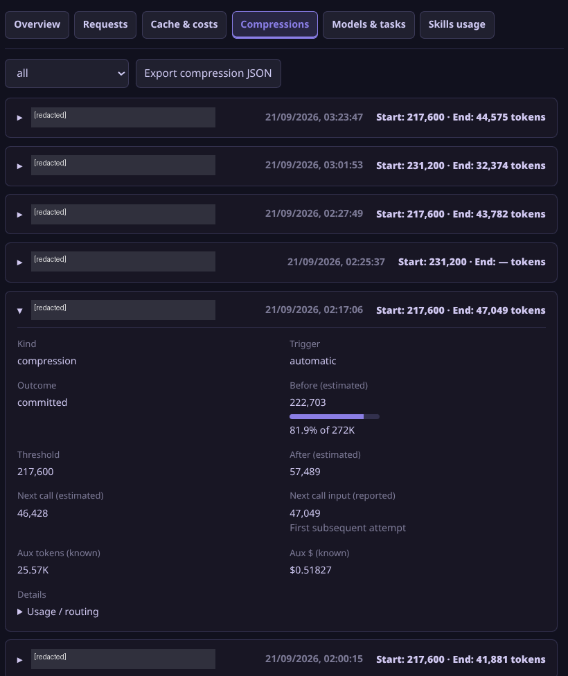</a>
<a href="docs/images/live-requests-cards.png">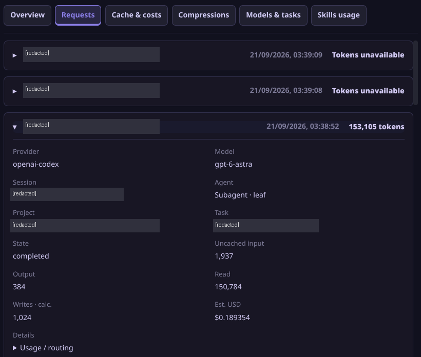</a>
</p>

<p>
<a href="docs/images/live-cache-cards.png">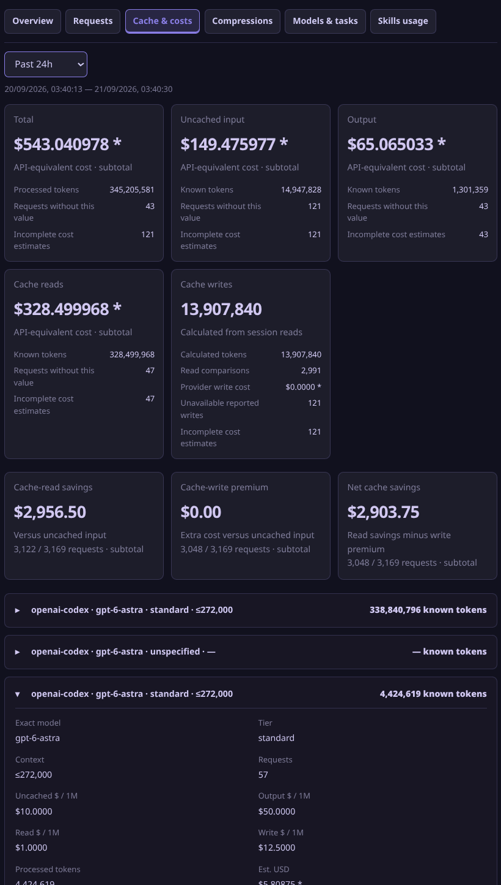</a>
<a href="docs/images/live-wide-summary.png">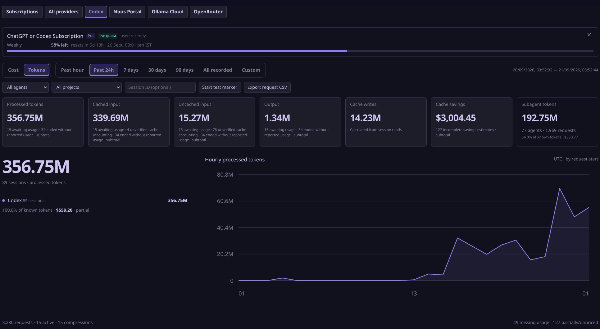</a>
</p>

<p>
<a href="docs/images/live-models-tasks.png">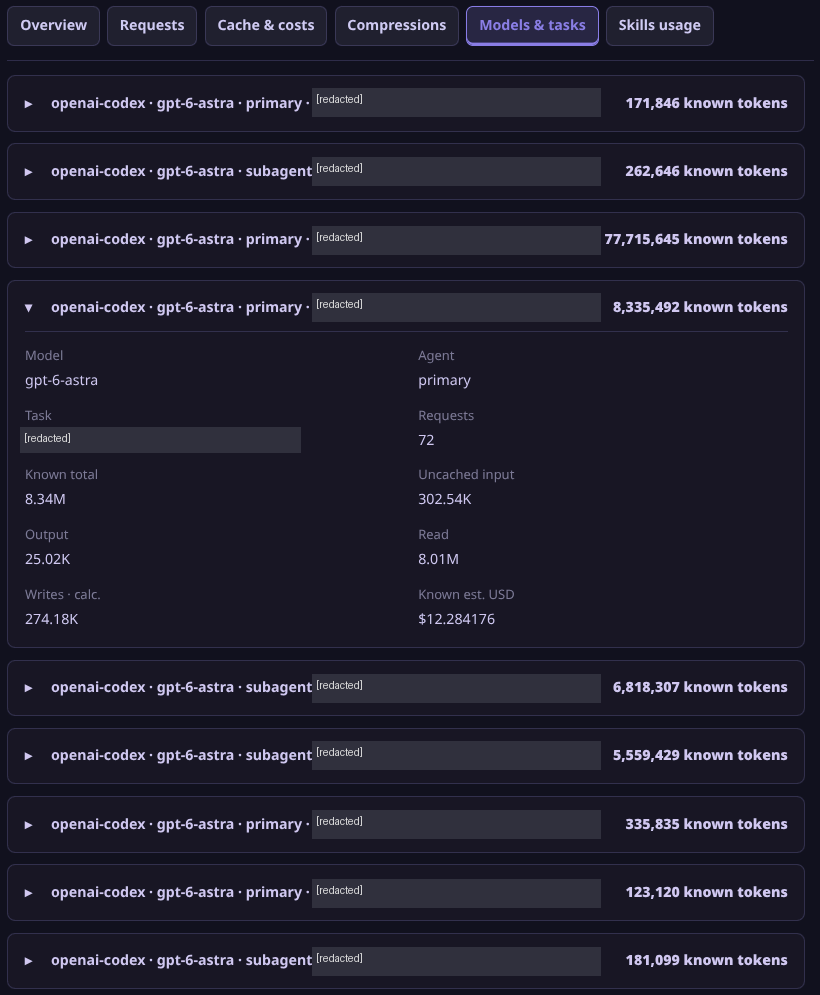</a>
<a href="docs/images/live-skills-thin.png">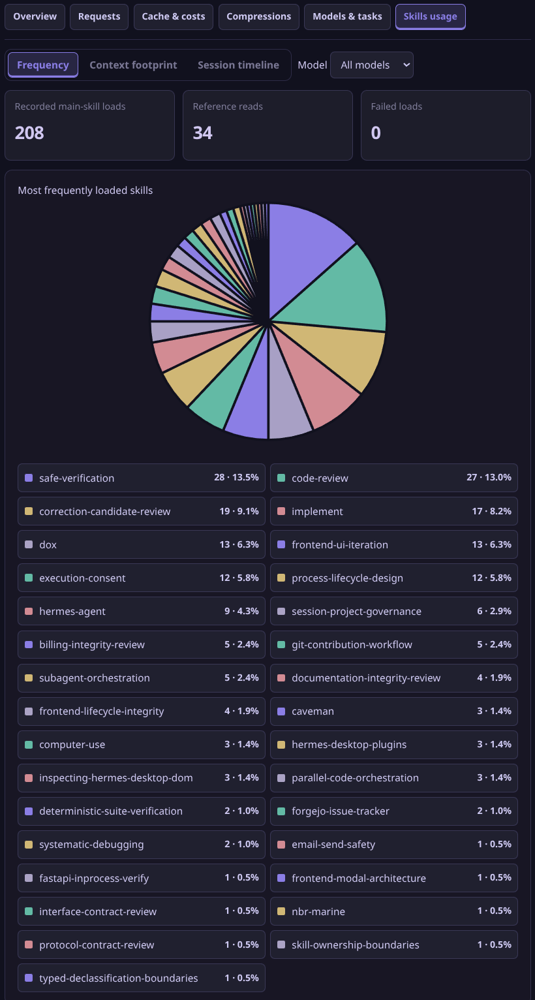</a>
</p>

<p>
<a href="docs/images/live-skills-wide.png">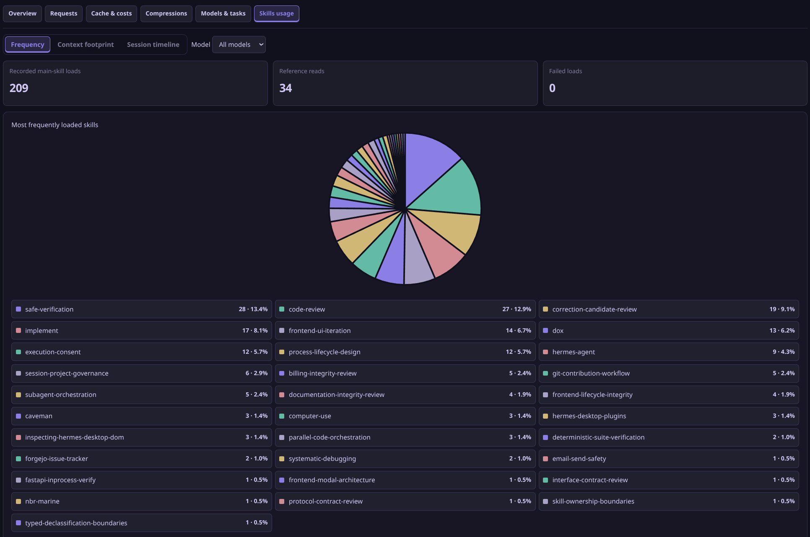</a>
<a href="docs/images/live-context-footprint.png">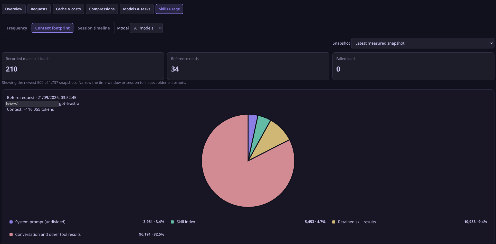</a>
</p>

<p>
<a href="docs/images/live-timeline.png">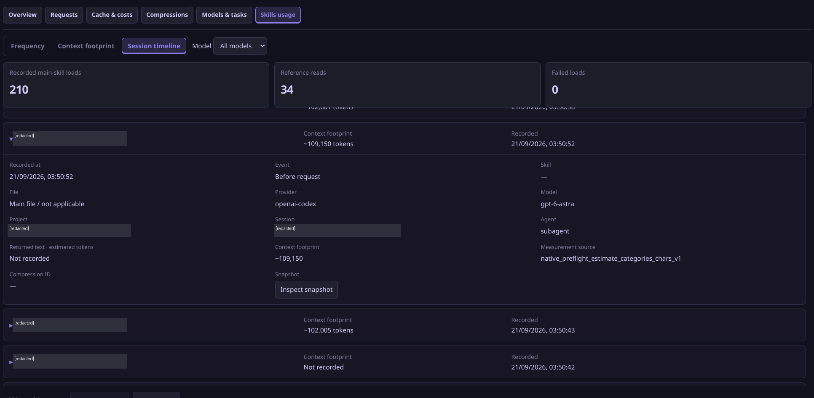</a>
</p>
